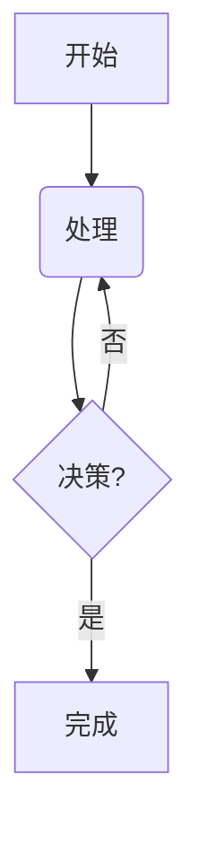

这是我的 LFSR 逻辑框图：

```mermaid
graph TD
    subgraph 5-Stage Shift Register
        direction LR
        A1(a₁) --> A2(a₂) --> A3(a₃) --> A4(a₄) --> A5(a₅)
    end
    A5 -- 输出序列 --> Output(Output)
    A1 --.-> XOR(⊕)
    A3 --.-> XOR
    XOR -- 反馈 --> A1
```

这是一个简单的测试图：


