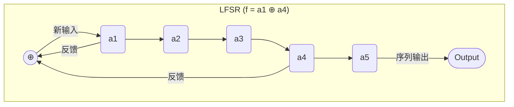

```mermaid
graph TD
    subgraph "LFSR (f = a1 ⊕ a4)"
        XOR((⊕)) -- "新输入" --> a1(a1);
        a1 --> a2(a2);
        a2 --> a3(a3);
        a3 --> a4(a4);
        a4 --> a5(a5);
        a5 -- "序列输出" --> Output([Output]);

        a1 -- "反馈" --> XOR;
        a4 -- "反馈" --> XOR;
    end
```
